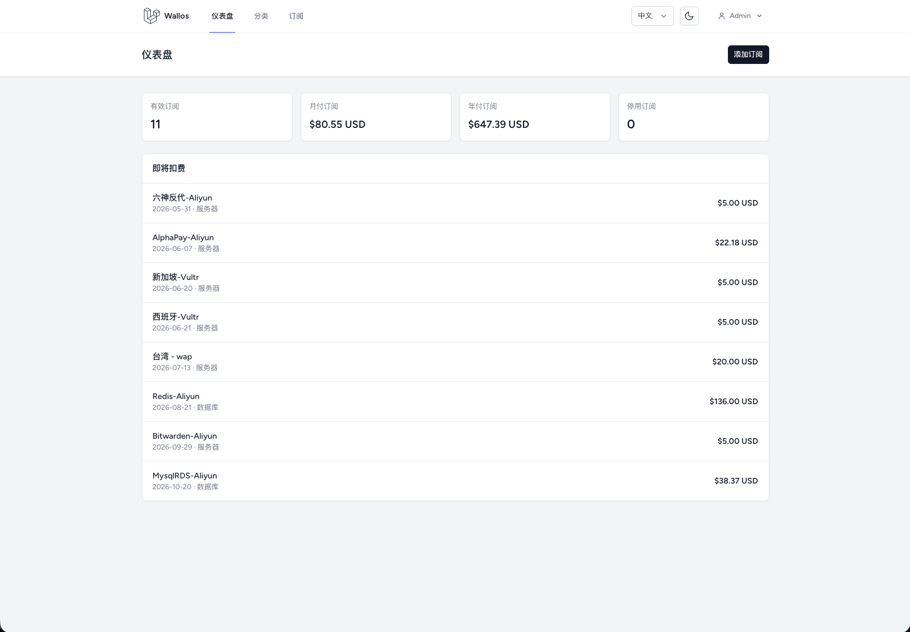
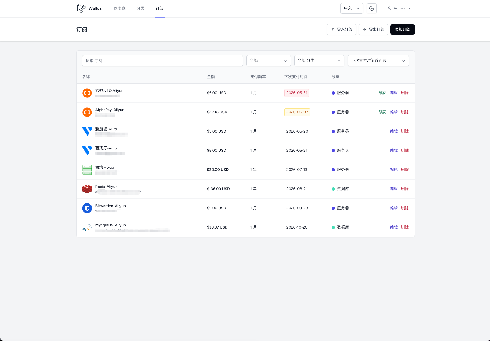
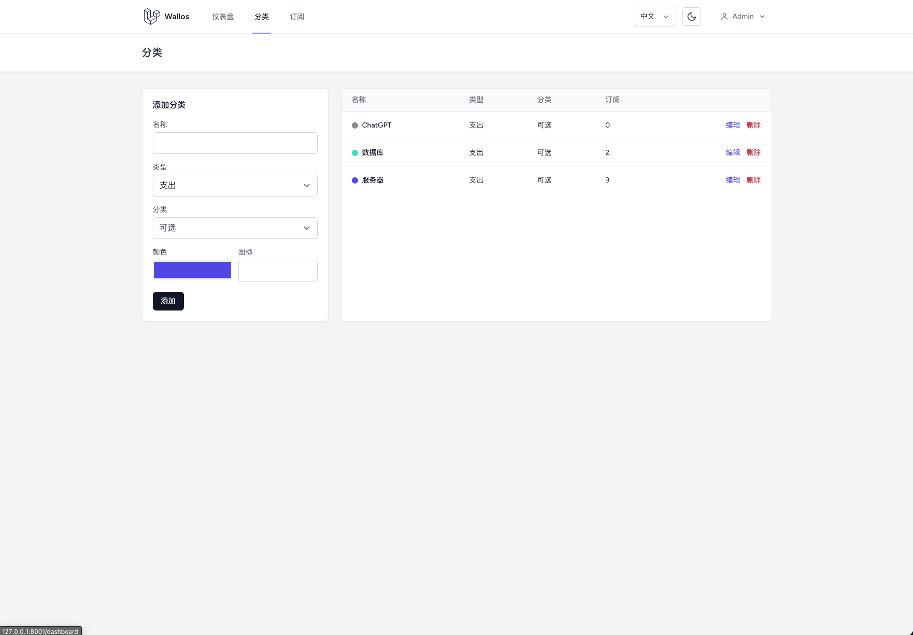
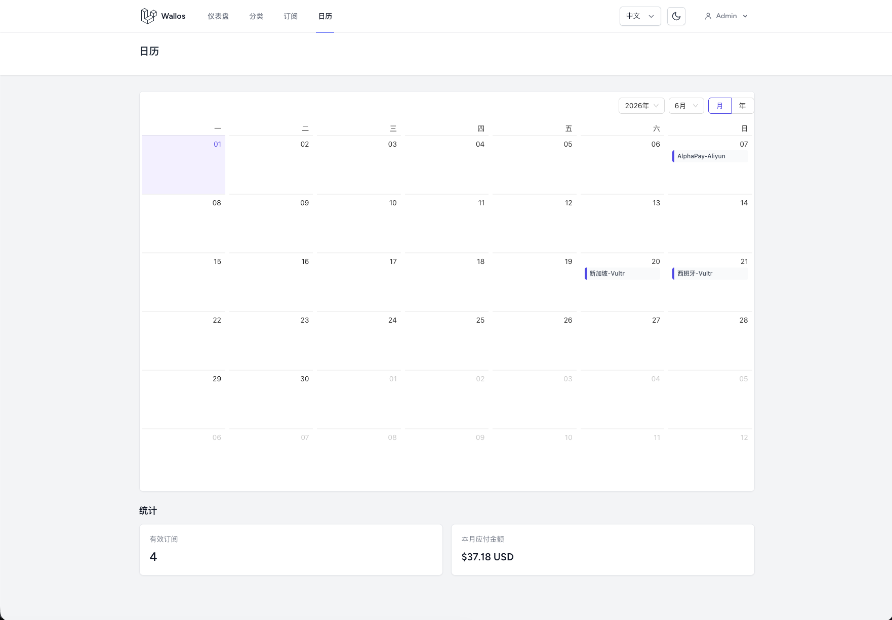
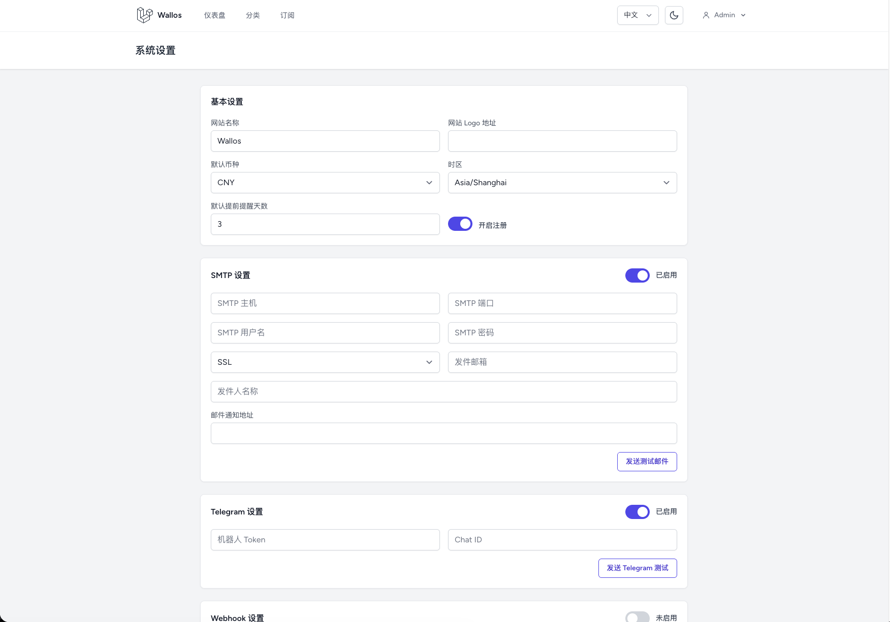

# Wallos

[简体中文](README.zh-CN.md) | English

Wallos is an open-source personal subscription tracking and finance management app.

## Features

- Chinese-first interface with an English language switcher
- Authentication, profile, and password management
- Income and expense categories
- Subscription tracking with billing cycles and due dates
- Dashboard with active subscriptions, monthly/yearly subscription totals, and upcoming charges

## Screenshots

### Dashboard



### Subscriptions



### Categories



### Calendar



### System Settings



## Stack

- Laravel 12
- SQLite
- Inertia.js + Vue 3
- Tailwind CSS
- Pest
- Docker Compose

## Local Development

Use Node 20+ and PHP 8.2+ if you run the app directly on your machine.

```bash
cp .env.example .env
composer install
php artisan key:generate
php artisan storage:link
touch database/database.sqlite
php artisan migrate --seed
npm install
npm run dev
php artisan serve
```

## Docker

```bash
cp .env.example .env
docker compose up --build
```

Open http://localhost:8001.

Vite runs on http://localhost:5173.

The first database setup seeds a default administrator:

- Email: `admin@qq.com`
- Password: `123456`

## Domain Foundation

The first migrations include:

- categories
- subscriptions

Money is stored as integer cents (`amount_cents`) to avoid floating-point rounding errors.

## Tests

```bash
php artisan test
```
